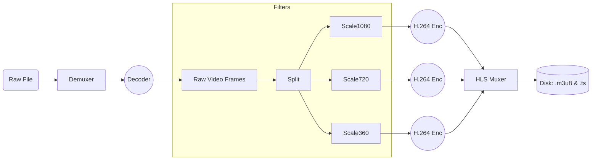

# FFmpeg CLI Basics: Advanced Usage for StreamForge

You won't just be running simple conversion commands. You need to build a pipeline that takes **one input** and produces **four outputs** (1080p, 720p, 480p, 360p) simultaneously to save CPU (decoding the input only once).

## 1. The "Complex Filter" Graph

The magic of FFmpeg lies in the `-filter_complex` flag. It allows you to build a processing tree.

### The Command (Conceptual)

```bash
ffmpeg -i input.mp4 \
  -filter_complex \
  "[0:v]split=3[v1][v2][v3]; \
   [v1]scale=w=1920:h=1080[v1out]; \
   [v2]scale=w=1280:h=720[v2out]; \
   [v3]scale=w=854:h=480[v3out]" \
  -map "[v1out]" -c:v:0 libx264 -b:v:0 5000k -maxrate:v:0 5350k -bufsize:v:0 7500k \
  -map "[v2out]" -c:v:1 libx264 -b:v:1 2800k -maxrate:v:1 2996k -bufsize:v:1 4200k \
  -map "[v3out]" -c:v:2 libx264 -b:v:2 1400k -maxrate:v:2 1498k -bufsize:v:2 2100k \
  -f hls \
  -var_stream_map "v:0,a:0 v:1,a:1 v:2,a:2" \
  -master_pl_name master.m3u8 \
  -hls_time 6 \
  -hls_playlist_type vod \
  %v/stream.m3u8
```
*(Note: This is a complex example. In Phase 1, we might run separate commands for simplicity, but the single-command approach is the "Senior Engineer" way).*

---

## 2. Essential Flags for HLS & Quality

To ensure your stream works professionally, you must understand these flags:

### A. GOP Alignment (`-g` and `-keyint_min`)
*   **The Rule:** HLS segments must start with an I-Frame.
*   **The Problem:** Default FFmpeg inserts I-Frames whenever it feels like it (scene detection).
*   **The Fix:** Force a fixed rhythm.
    *   Target: 2-second GOP (standard).
    *   If FPS = 30, then GOP = 60 frames.
    *   Flag: `-g 60 -keyint_min 60 -sc_threshold 0`
    *   `-sc_threshold 0`: Disable scene change detection (prevents random I-Frames).

### B. Constant Bitrate (CBR) vs Variable (VBR)
*   **VBR (Default):** "Use less data for simple scenes, more for complex ones." Efficient, but unpredictable peaks can cause buffering.
*   **Constrained VBR:** "Do what you want, but NEVER exceed this limit."
    *   `-maxrate 5350k`: Never go above 5.3 Mbps.
    *   `-bufsize 7500k`: The decoder buffer size (crucial for valid HLS).

### C. Presets (`-preset`)
*   Speed vs Compression.
*   `ultrafast`: Encodes instantly, creates huge files.
*   `veryslow`: Takes forever, creates tiny files.
*   `fast` or `medium`: Good balance for your project.

### D. Pixel Format (`-pix_fmt yuv420p`)
*   **Critical:** Professional cameras use high-color formats (yuv422, yuv444). Browsers/Players **cannot** play these.
*   **Always** force `-pix_fmt yuv420p` to ensure compatibility with Chrome/Safari/Edge.

---

## 3. Pipeline Diagram



## 4. Piping Input (Stdin)
When using Golang to drive FFmpeg:
```go
cmd := exec.Command("ffmpeg", "-i", "pipe:0", ...)
cmd.Stdin = myUploadStream // Connects HTTP Request Body to FFmpeg
```
*   **Issue:** FFmpeg needs to know the format if it can't see a filename extension.
*   **Fix:** Add `-f` before the input. E.g., `ffmpeg -f mp4 -i pipe:0`. (Actually, for generic ingest, `-f` might be hard to guess, often we save to a temp file first for safety, but piping is the advanced goal).