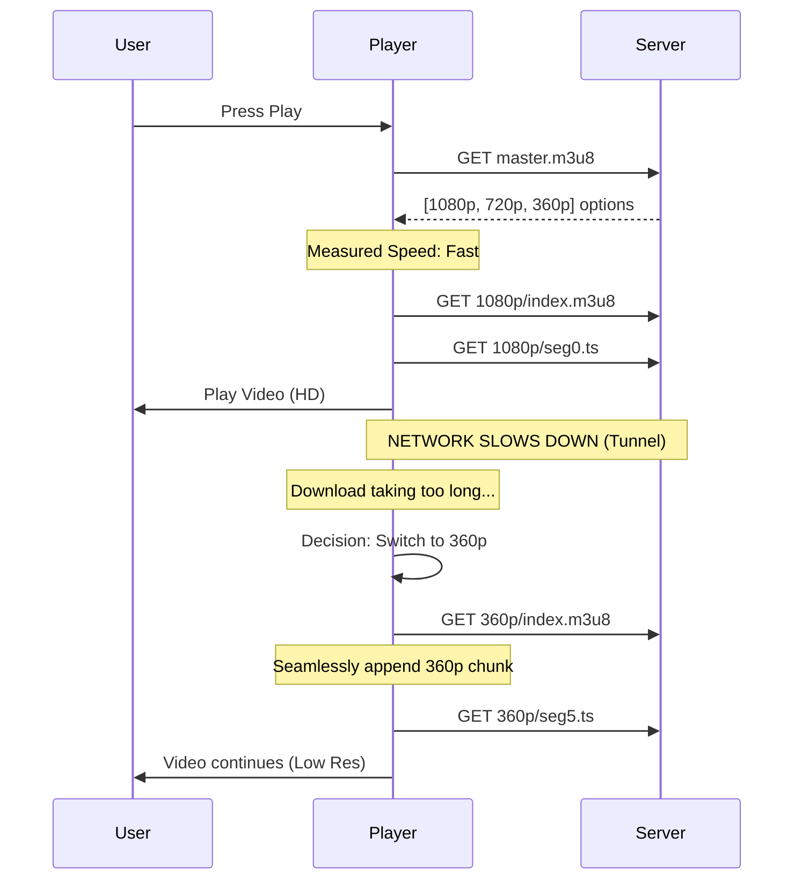

# HLS (HTTP Live Streaming): Architecture & Mechanics

HLS is not just a file format; it's a delivery protocol. It shifts the complexity of streaming from the **Server** (which used to have to maintain complex active connections) to the **Client** (which just downloads files).

## 1. The HLS File Structure

You need to generate a hierarchy of files.

### A. The Master Playlist (`master.m3u8`)
This file is the entry point. It describes the **Variants** (different quality levels).

```m3u8
#EXTM3U
#EXT-X-VERSION:3

# Variant 1: 1080p, 5Mbps
#EXT-X-STREAM-INF:BANDWIDTH=5000000,RESOLUTION=1920x1080,CODECS="avc1.4d4028,mp4a.40.2"
1080p/index.m3u8

# Variant 2: 720p, 2.8Mbps
#EXT-X-STREAM-INF:BANDWIDTH=2800000,RESOLUTION=1280x720,CODECS="avc1.4d401f,mp4a.40.2"
720p/index.m3u8

# Variant 3: 360p, 800Kbps
#EXT-X-STREAM-INF:BANDWIDTH=800000,RESOLUTION=640x360,CODECS="avc1.4d401e,mp4a.40.2"
360p/index.m3u8
```
*   `BANDWIDTH`: The peak bitrate in bits/sec. The player uses this to decide if it can afford this stream.
*   `CODECS`: Tells the player exactly what is inside so it doesn't crash trying to play unsupported formats.

### B. The Media Playlist (`1080p/index.m3u8`)
This file lists the actual segments for **one specific quality**.

```m3u8
#EXTM3U
#EXT-X-VERSION:3
#EXT-X-TARGETDURATION:4               <-- Max segment length is 4s
#EXT-X-MEDIA-SEQUENCE:0               <-- The first segment number
#EXT-X-PLAYLIST-TYPE:VOD              <-- "Video On Demand" (Static file)

#EXTINF:4.000,                        <-- Exact duration of next file
segment_000.ts
#EXTINF:4.000,
segment_001.ts
#EXTINF:3.500,                        <-- Last segment might be shorter
segment_002.ts

#EXT-X-ENDLIST                        <-- "The movie ends here"
```

### C. The Segments (`.ts`)
These are standard MPEG-TS files containing H.264 video and AAC audio. They are playable on their own (mostly).

---

## 2. Adaptive Bitrate (ABR) Logic

This is the logic running inside the Video Player (Frontend).

1.  **Buffer-Based Strategy:**
    *   The player tries to keep a safety buffer (e.g., 30 seconds of video loaded ahead).
    *   **Scenario:** Buffer is full (30s). Player logic: "I'm safe. I'll try to download the highest quality (1080p)."
    *   **Scenario:** Buffer is dropping (only 5s left). Player logic: "Panic! Download the smallest file possible (360p) just to keep playing!"

2.  **Throughput-Based Strategy:**
    *   The player measures how long it took to download the last chunk.
    *   `Size (5MB) / Time (2s) = 2.5 MB/s (20 Mbps)`.
    *   "I have 20 Mbps speed. I can comfortably play the 5 Mbps stream."

---

## 3. Sequence Diagram: The Switching Event



## 4. Key Challenges for Implementation

1.  **Segment Alignment:**
    *   Chunk 5 of the 1080p stream MUST start at the exact same millisecond as Chunk 5 of the 360p stream.
    *   If they don't align, when the player switches quality, the video will jump or stutter.
    *   *Solution:* Fixed GOP size in FFmpeg (See `ffmpeg_basics.md`).

2.  **Manifest Generation:**
    *   You can't hand-write these `.m3u8` files.
    *   FFmpeg can generate them automatically using the `hls` muxer.

3.  **CORS:**
    *   Since video segments are loaded via XHR/Fetch by the player logic, your file server MUST return correct CORS headers (`Access-Control-Allow-Origin: *`), or the browser will block the stream.