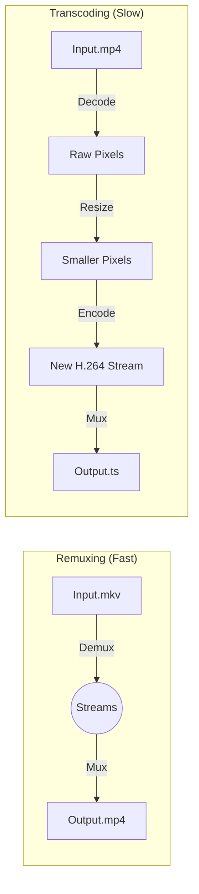

# Multiplexing, Demultiplexing, and Remuxing: The Traffic Control of Video

In the world of video engineering, you will constantly hear terms like "Mux," "Demux," and "Remux." These sound complex, but they describe very simple data management tasks.

Think of a video file not as a solid block, but as a **braid** of different threads (Video, Audio, Subtitles) twisted together.

## 1. Multiplexing (Muxing)
**The Act of Assembly.**

*   **Definition:** Multiplexing is the process of taking separate streams (e.g., a video stream, an audio stream, and a subtitle stream) and interleaving them into a single container file.
*   **The Problem:** If you just sent the video file and then the audio file separately, the player wouldn't know which audio byte matches which video frame.
*   **The Solution:** The Muxer cuts the video and audio into tiny pieces (packets) and alternates them in the file.
    *   `[Header]`
    *   `[Video Packet 1 (Frame 1)]`
    *   `[Audio Packet 1 (0.0s - 0.5s)]`
    *   `[Video Packet 2 (Frame 2)]`
    *   `[Audio Packet 2 (0.5s - 1.0s)]`
*   **Result:** When the player reads the file, it receives both video and audio data simultaneously, keeping them in sync.

## 2. Demultiplexing (Demuxing)
**The Act of Disassembly.**

*   **Definition:** The reverse of muxing. It is the process of reading a container file and separating the interleaved streams back into their raw components.
*   **When it happens:** Every time you play a video.
*   **Process:**
    1.  The Player opens `movie.mp4`.
    2.  The **Demuxer** reads the file.
    3.  It throws `Video Packet 1` to the **Video Decoder** (e.g., H.264 decoder).
    4.  It throws `Audio Packet 1` to the **Audio Decoder** (e.g., AAC decoder).

## 3. Remuxing
**The Container Swap.**

*   **Definition:** Taking the streams out of one container (Demux) and immediately putting them into a different container (Mux) **without** changing the actual data (Transcoding).
*   **Analogy:** Taking a letter out of a *FedEx* envelope and putting it into a *UPS* envelope. You didn't rewrite the letter; you just changed how it was delivered.
*   **Key Characteristics:**
    *   **Speed:** Extremely fast (limited only by disk speed).
    *   **Quality:** Lossless (pixel perfect copy).
    *   **CPU:** Very low usage.

### Comparison Table

| Action | What happens? | Speed | CPU Usage | Example |
| :--- | :--- | :--- | :--- | :--- |
| **Transcoding** | Decompressing pixels and re-compressing them. | **Slow** | **Very High** | Convert 1080p to 720p. |
| **Remuxing** | Moving existing streams from one container to another. | **Fast** | **Very Low** | Convert `.mkv` to `.mp4` (if codecs are compatible). |

## 4. Why StreamForge Needs This (The Strategic View)

In StreamForge, Remuxing isn't just a convenience; it's a critical optimization strategy for a high-performance backend.

### A. Zero-Latency Ingest
When a user uploads a video, they expect to see it in their dashboard immediately. 
*   **The Problem:** Transcoding a 1GB file to H.264 might take 5 minutes.
*   **The Solution:** If the user uploaded an `.mkv` or `.mov` that *already* contains H.264 video, we **Remux** it to `.mp4` in under 5 seconds. The user sees their "Master" video is "Ready" almost instantly while the background transcoding for lower resolutions (720p, 480p) continues.

### B. Massive CPU/Cost Savings
Transcoding is the most expensive operation in a video platform.
*   **Scenario:** A user uploads a high-quality 1080p H.264 file. Our system requires a 1080p variant for HLS.
*   **Optimization:** Instead of re-encoding (Transcoding) the 1080p stream—which loses quality and burns CPU—we simply **Remux** the existing 1080p stream into the HLS `.ts` segments. We get perfect quality with near-zero CPU cost.

### C. Standardizing the "Master" Storage
Users upload chaotic formats. By remuxing everything to a "Fast Start" MP4 immediately:
*   We ensure our `raw/` storage folder is uniform.
*   Our downstream processing tools (FFmpeg scaling filters) don't have to guess how to handle 50 different container types; they only ever see standardized MP4s.

### D. Web Compatibility
Browsers cannot play `.mkv` or `.avi`. By remuxing these into `.mp4` during the ingest phase, we make the source file playable in the React frontend without requiring the HLS pipeline to finish first.

## 5. Visualizing the Flow

