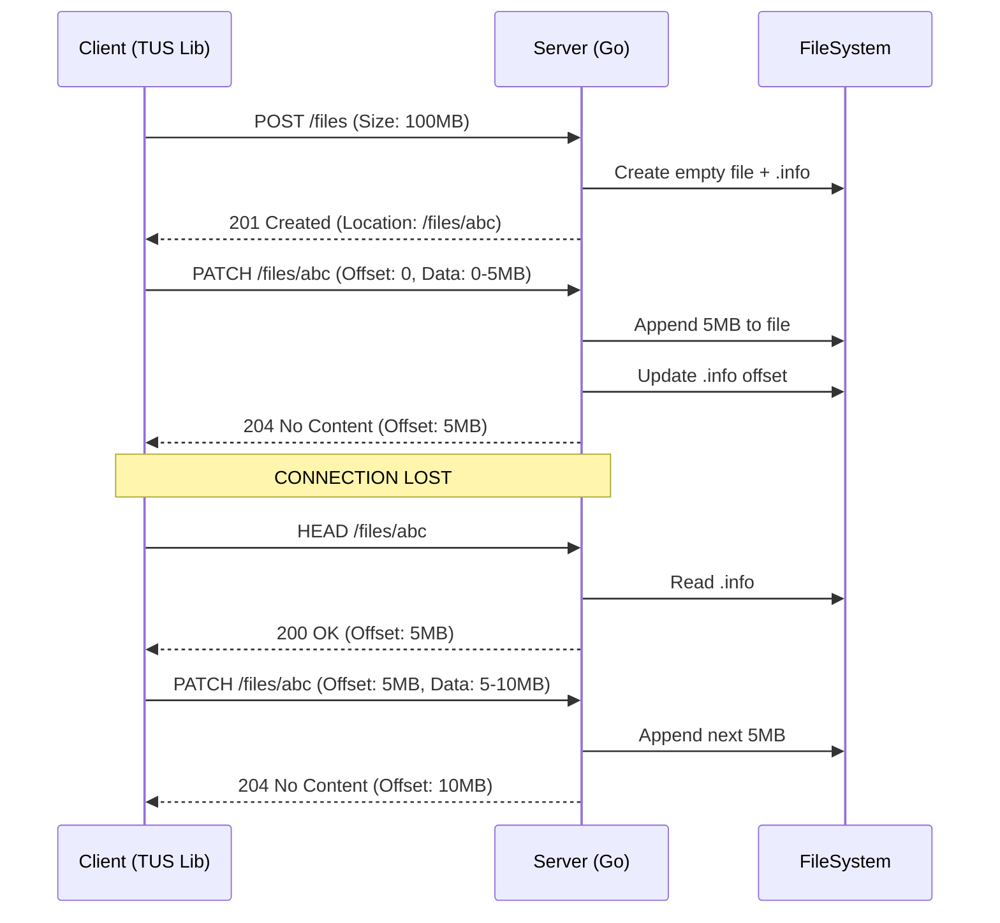

# The TUS Protocol: Architecture & Implementation

TUS is an HTTP-based protocol for resumable file uploads. It solves the problem of unreliable mobile connections.

## 1. The Core Lifecycle

A TUS upload is a stateful session.

### Phase A: Creation (POST)
The client tells the server it wants to start.

**Request:**
```http
POST /files HTTP/1.1
Host: api.streamforge.com
Tus-Resumable: 1.0.0
Upload-Length: 500000000  <-- Size of file (500MB)
Upload-Metadata: filename dmlkZW8ubXA0,filetype dmlkZW8vbXA0 <-- Base64 encoded
```

**Response:**
```http
HTTP/1.1 201 Created
Location: https://api.streamforge.com/files/24e533e02404252
Tus-Resumable: 1.0.0
```
*   The Server creates a blank file (0 bytes) and an info file (`.info`) to track metadata.
*   The `Location` header gives the unique URL for this specific upload.

### Phase B: Transfer (PATCH)
The client uploads the data. It can upload the whole thing, or just a piece.

**Request:**
```http
PATCH /files/24e533e02404252 HTTP/1.1
Tus-Resumable: 1.0.0
Upload-Offset: 0          <-- "I am starting from the beginning"
Content-Type: application/offset+octet-stream
Content-Length: 1048576   <-- Sending 1MB chunk

[BINARY DATA]
```

**Response:**
```http
HTTP/1.1 204 No Content
Tus-Resumable: 1.0.0
Upload-Offset: 1048576    <-- "Ack. Next time start at byte 1,048,576"
```

### Phase C: The Crash (HEAD)
*Network fails.* The client reconnects. It doesn't know what happened.

**Request:**
```http
HEAD /files/24e533e02404252 HTTP/1.1
Tus-Resumable: 1.0.0
```

**Response:**
```http
HTTP/1.1 200 OK
Upload-Offset: 1048576
Upload-Length: 500000000
```
*   The client now knows: "Okay, the server has the first 1MB. I should slice my local file and send from byte 1,048,576."

---

## 2. Server-Side Storage Structure

You shouldn't just dump files in a folder. You need structure.

```text
/data/uploads/
  ├── 24e533e02404252.bin      <-- The raw binary data (grows as PATCH comes in)
  ├── 24e533e02404252.info     <-- JSON metadata (Offset, Length, Metadata)
  └── 24e533e02404252.lock     <-- Lock file to prevent concurrent writes
```

## 3. Concurrency & Locking

**Critical Issue:** What if the user opens two tabs and tries to upload to the same URL at the same time?
*   Request A writes bytes 0-100.
*   Request B writes bytes 0-100.
*   The file becomes corrupted or double-length.

**Solution:** Exclusive File Locks.
*   When a `PATCH` request arrives, the server MUST acquire an OS-level lock on the file.
*   If another request arrives, it sees the lock and returns `423 Locked` or waits.

## 4. Sequence Diagram: TUS Flow



## 5. Why TUS is better than "Multipart/Form-Data"
*   **Multipart:** Good for small files. If a 1GB upload fails at 99%, you retry the WHOLE 1GB.
*   **TUS:** You retry only the last 1% (or just the last chunk).